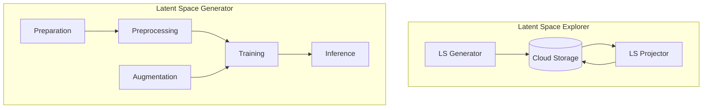

# Latent space generator

This repository implements a Machine Learning pipeline that produces latent space to be explored in the projector lse.neanias.eu.




Full detailed pipeline info will be available in specific readme:

-   [Data preparation](./docs/PREPARATION.md)
-   [Data preprocessing](./docs/PREPROCESSING.md)
-   [Data Augmentation](./docs/AUGMENTATION.md)
-   [Training](./docs/TRAINING.md)
-   [Inference](./docs/INFERENCE.md)

Here follows a quick start guide to go quick in a working example.

---

## Setup

1. Download or clone the code

    ```bash
    git clone git@gitlab.neanias.eu:s3-service/latent-space-explorer/generator.git
    ```

2. Environment setup

    - pip env

        ```bash
        python -m venv .venv
        source /.venv/bin/activate
        pip install -r requirements.txt
        ```

    - docker image

        ```bash
        docker run -it -p 6006:6006 --gpus=all -v $PWD:/workdir dr4thmos/lsg-gpu:0.1
        ```

---

## Import data

1. Copy your sources into `/data/input`

    - For images, you could use extensions like jpeg, jpg or png
    - For fits, your sources need to be folders with inside a fits file per band

        ```
        /Source001
            <survey_band1-name>.fits
            <survey_band2-name>.fits
            ...
        /Source002
            <survey_band1-name>.fits
            <survey_band2-name>.fits
            ...
        ```

    - For numpy, copy as they are

2. Describe your input in the config.json file image section

    ```json
    "image": {
        "format": "fits",
        "dim": 32,
        "channels": {
        "map": {
            "survey_band1-name": 2,
            "survey_band2-name": 0,
            "survey_band3-name": 1,
            "survey_band4-name": 3,
            "survey_band5-name": 4,
            "survey_band6-name": 4
        },
            "preview": {
                "r": 4,
                "g": 0,
                "b": 2
            }
        }
    }
    ```

---

## Training

1. Choose one of the prepared config files in order to start and copy it to the project root (near the `main.py` file)

    - [Convolutional Autoencoder](./docs/templates/cae.json)
    - [Convolutional Variational Autoencoder](./docs/templates/cvae.json)
    - [SimClr](./docs/templates/simclr.json)

2. Start the training

    ```bash
    python main.py training
    ```

3. Start tensorboard to monitor the training

    ```bash
    tensorboard --logdir logs
    ```

---

## Export

1. Fill the config file

    ```
    "inference": {
        "save_generated_images": false
    }
    ```

2. Start the inference on a specific model in the `/models` folder

    ```
    python main.py inference --experiment <experiment-folder>
    ```

3. Upload the folder created into nextcloud `/lse-<your-email>` shared folder
